# SalesforceHeroku
Sample of the Salesforce/Heroku integration

## Intro - What you need

### General
 - Your WIFI *network name* and *password*
 - A smartphone (iOS or Android)
 - A computer with a web browser

### Accounts
  - An [Electric Imp developer account](https://ide.electricimp.com/login)
  - The Electric Imp BlinkUp app ([iOS](https://itunes.apple.com/us/app/electric-imp/id547133856) or [Android](https://play.google.com/store/apps/details?id=com.electricimp.electricimp))
  - A [Salesforce developer account](https://developer.salesforce.com/signup?d=70130000000td6N)
  - A [free Heroku account](https://signup.heroku.com)

### Hardware
  - An Electric Imp developer kit
    - Imp 001
    - Explorer Kit Sensor Board

And if you want to install the board into a fridge:

  - 3 AA Batteries

### Software
 - [Agent code](./SmartRefrigerator_ExplorerKit_Salesforce.agent.nut)
 - [Device code](./SmartRefrigerator_ExplorerKit_Salesforce.device.nut)
 - [Heroku application](./HerokuApp) files

## Getting Started

### Step 1: Setup the Electric Imp hardware

First we will need to assemble the Electric Imp Developer Kit.  The kit comes with (1) the imp001 card, which has a WiFi radio and micorocontroller which drives all the logic for the board, (2) the Explorer Kit board into which the card is plugged.  The Explorer Kit board provides a set of sensors and peripherals which are ready to use. For this project will read temperature, humidity, accelerometer data and light to determine the current state of your fridge.

#### Hardware Setup
 - Plug the imp001 card into the breakout board slot
 - Power up your Imp with the AA Batteries
 - The Imp001 should now have power and be blinking amber/red

Assmbled it should look like this:


#### Electric Imp BlinkUp

Use the Electric Imp mobile app to BlinkUp your device

 - Log into your Electric Imp account
 - Enter your WIFI credentials
 - Follow the instructions in the app to [BlinkUp](https://electricimp.com/platform/blinkup/) your device

 If you have any issues getting started with your Electric Imp account or device, see [the full getting started guide](https://electricimp.com/docs/gettingstarted/quickstartguide/).

### Step 2: Add Code for the Electric Imp

#### How Electric Imp's connectivity platform works


The Electric Imp IoT Connectivity Platform has two main components -- the impDevice and the impCloud.  The impDevice runs the device code, which in this use case consolidates the data gathered by the temperature/humidity/light sensors.  Each device is paired one-to-one with a "virtual twin" -- or, as we call it, an agent -- in the impCloud.  The device sends this data to its agent, which runs agent code. In this example the agent code executes the logic on the sensor data (e.g. light values show fridge is open) and communicates with the Salesforce cloud.  Here's a broad overview of this flow:


The Electric Imp IDE provides all the tools you need to write and deploy the software (to the device and agent) that will control your imp-enabled connected product. The IDE runs in a desktop web browser and communicates between the device and cloud solutions.

 If you'd like a quick overview of the IDE features please visit the Electric Imp [Dev Center](https://electricimp.com/docs/gettingstarted/ide/).

#### Electric Imp IDE / Code

 - In your favorite web browser log into the [Electric Imp IDE](https://ide.electricimp.com/login)
 - Click the *+* button to create a new model


 - In the pop up name your code model, select your device and click *Create Model* button
 - Copy and Paste the [agent code](./SmartRefrigerator_ExplorerKit_Salesforce.agent.nut) from github into the left side agent window
 - Copy and Paste the [device code](./SmartRefrigerator_ExplorerKit_Salesforce.device.nut) from github into the right side device window

 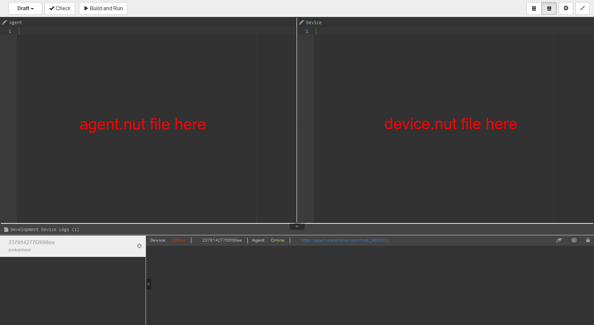

### Step 3: Create a Custom Object in Salesforce

**NOTE:** to follow this instruction please switch to the Salesforce Classic view by clicking on the profile icon at the top right corner of the screen and selecting `Switch to Salesforce Classic`

#### Creating a Custom Object in Salesforce

You will need to create a custom object with fields that correspond to each key in the reading table.  Here are the step by step instructions for creating a Custom Object:

1. Log into Salesforce and click on the **Setup** tab in the top right navigation menu

2. In the sidebar under **Build** unfold the **Create** menu and select **Objects**
3. At the top of the page click the **New Custom Object** button

4. In the **New Custom Object** form fill in:
    - Custom Object Information
      - **Label** - for example *SmartFridge*
      - **Plural Label** - for example *SmartFridges*
      - **Object Name** - for example *SmartFridge*
    - Enter Record Name Label and Format
      - **Record Name** - for example *Reading Id*
      - **Data Type** select **Auto Number**
      - **Display Format** - for example *R-{0000}*
    - When above info is filled out click **Save**
5. On the **Custom Objects Page** click on your object name
6. You will be redirected to the *Custom Object - your object name* page <br> You will repeat step 7 four times to add fields for each sensor reading collected <br> The **Field Name** must match the data table from the device. The **Field Names** in the example code are: **temperature**, **humidity** , **door**, **ts**.
7. At the bottom of the page under **Custom Fields & Relationships** click the **New** button
    - Step 1 *Data Type*
      - Select **Number** for temperature and humidity, **Text** for door, or **Date/Time** for ts
      - then click **Next** button
    - Step 2 of 4
      - Enter **Field Label** - for example *temperature*, *humidity*, *door*, or *ts*
      - Enter **Length** - for temperature and humidity *4*, for door *10*
      - Enter **Decimal Places** - for temperature and humidity *2*
      - Enter **Field Name** - this must match the keys from the device code, *temperature*, *humidity*, *door*, or *ts*
      - Enter **Description** - for example *Temperature reading in °C*
      - then click **Next** button
    - Step 3 of 4
      - click **Next** button
    - Step 4 of 4
      - click **Save & New** <br>
      **Repeat** Steps 1-4 for humidity,
8. We need to create one more Field the *Device Id field*
    - Step 1 *Data Type*
      - Select **text**
      - then click **Next** button
    - Step 2 of 4
      - Enter **Field Label** enter **deviceId**
      - Enter **Length** - for example *16*
      - Enter **Field Name** enter **deviceId**
      - check **Required**
      - check **Unique**
      - check **Test "ABC" and "abc" as different values (case sensitive)**
      - check **External ID**
      - then click **Next** button
    - Step 3 of 4
      - click **Next** button
    - Step 4 of 4
      - click **Save**
9. You will be redirected to the *Custom Object - your object name* page
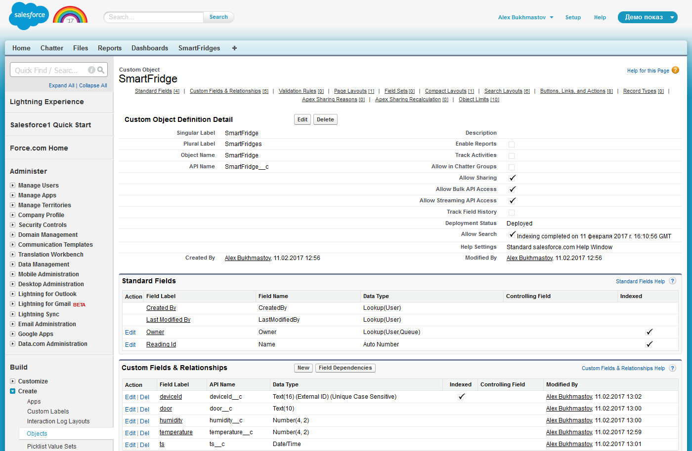

### Step 4: Create a Custom Case Field in Salesforce

We want the cases opened to contain the Device ID for our refrigerator.  To do this we need to create a custom field for our Salesforce case.  Here are the step by step instructions for creating a Custom Case Field:

1. Log into Salesforce and click on the **Setup** tab in the top right navigation menu

2. In the sidebar under **Build** unfold the **Customize** menu then unfold **Cases** and select **Fields**
3. Scroll to the bottom of the page and under **Case Custom Fileds & Relationships** click the **New** button

4. In the **New Custom Field** form fill in:
    - Step 1 *Data Type*
      - Select **Lookup Relationship**
      - then click **Next** button
      - Select "SmartFridge" as the related object
    - Step 2 of 4
      - Enter **Field Label** enter **Related Fridge**
      - Enter **Field Name** enter **Related_Fridge**
      - Enter **Description** (optional) for example *Device Id of the associated refrigerator*
      - then click **Next** button
    - Step 3 of 4
      - click **Next** button
    - Step 4 of 4
      - click **Save**
9. You will be redirected to the *Case Custom Field - your field name* page
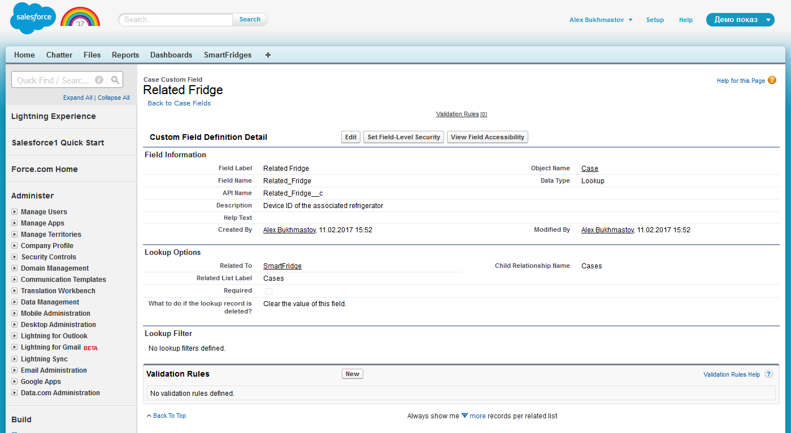

### Step 5: Create a Heroku App

Step by step instructions to create a Heroku App:

1. Log into Heroku and click on the **New** button, then click on the **Create new app** button
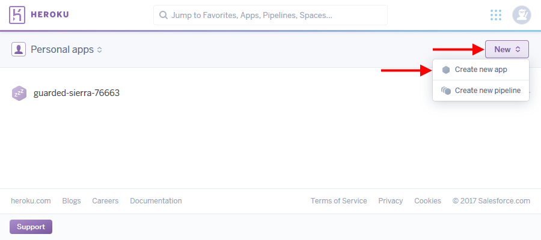
2. Enter **app name** and **runtime selection**, then click **Create App** button
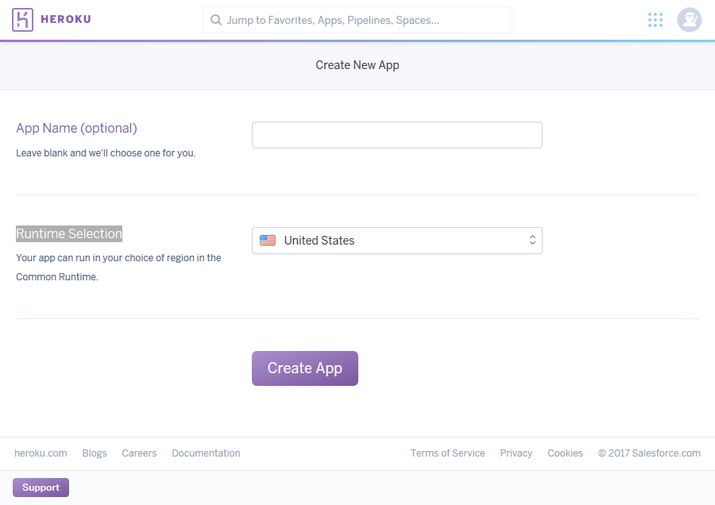
3. Go to **Resourses** tab on the top of the page to install add-ons
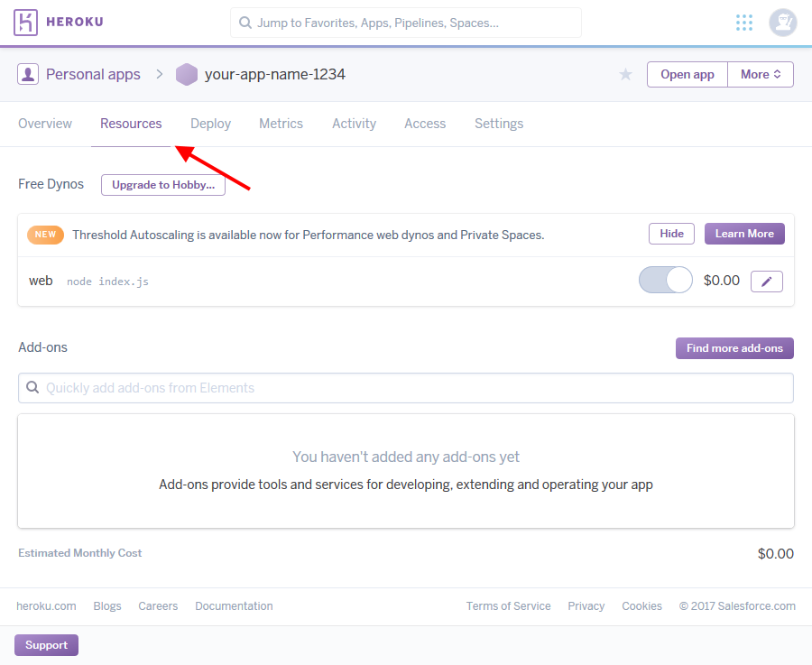
	- Install Heroku Connect add-on
		- Type **heroku connect** in the add-ons search input and select **Heroku Connect** from the dropdown list
		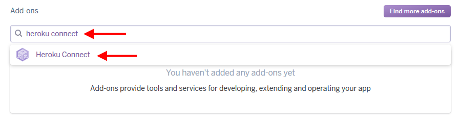
		- Choose plan and click **Provision** button
		
	- Install Heroku Postgres add-on
		- Type **heroku postgres** in the add-ons search input and select **Heroku Postgres** from the dropdown list
		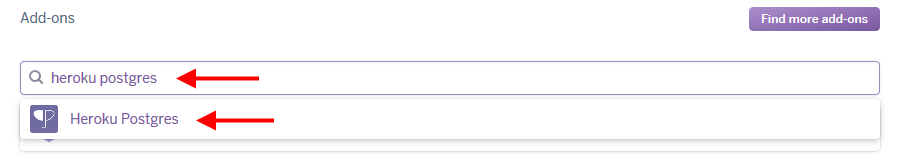
		- Choose plan and click **Provision** button
		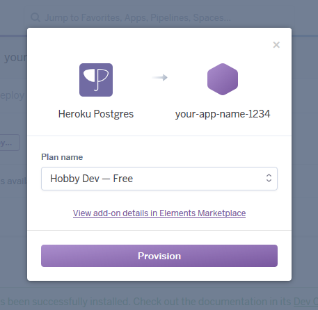
	- Heroku Connect setup
		- Click **Heroku Connect** in the Add-ons list
		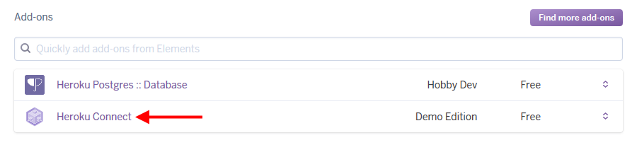
		- Setup connection
			- Click **Setup connection**
			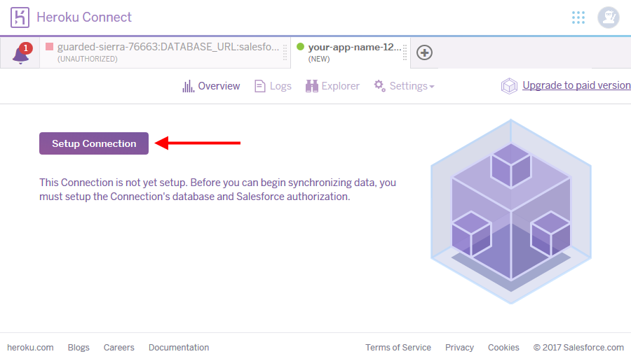
			- Click **Next**
			- Click **Authorize**
			- Authorize in your Salesforce account and click **Allow** to allow Heroku Connect access to your Salesforce account
		- Create Mapping
			- Click **+ Create Mapping**
			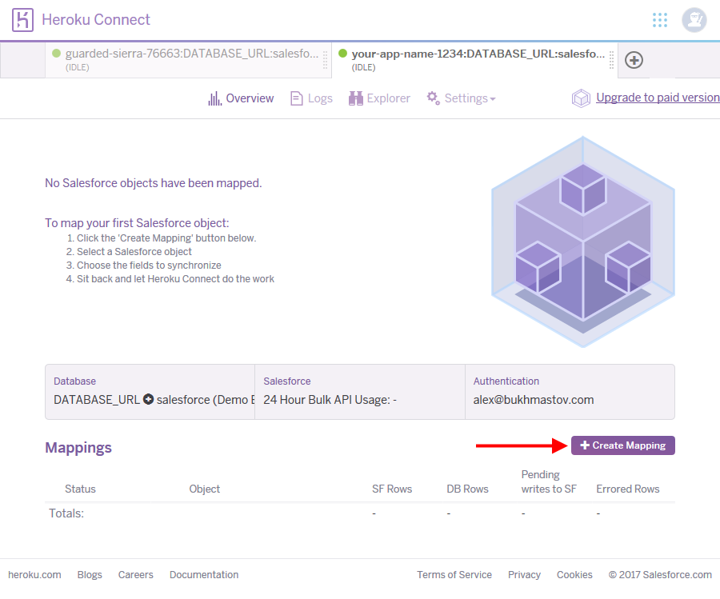
			- Choose **SmartFridge__c** object
				1. Select **Write to Salesforce any updates to your database** checkbox
				2. Choose **deviceId__c** upsert Field
				3. Select **door__c**, **humidity__c**, **temperature__c**, **ts__c** fields
				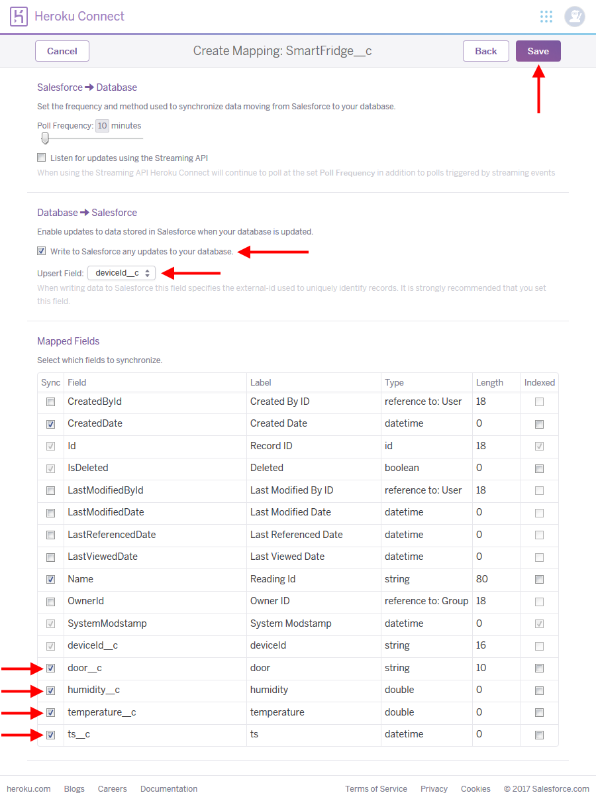
			- Click **Save** button
			- Click **+ Create Mapping**
			- Choose **Case** object
				1. Select **Write to Salesforce any updates to your database** checkbox
				2. Select **Description**, **Subject**, **Related_Fridge__c**, **Related_Fridge__r__deviceId__c** fields
			- Click **Save** button			
4. Go to **Deploy** tab on the top of the page to deploy heroku application files
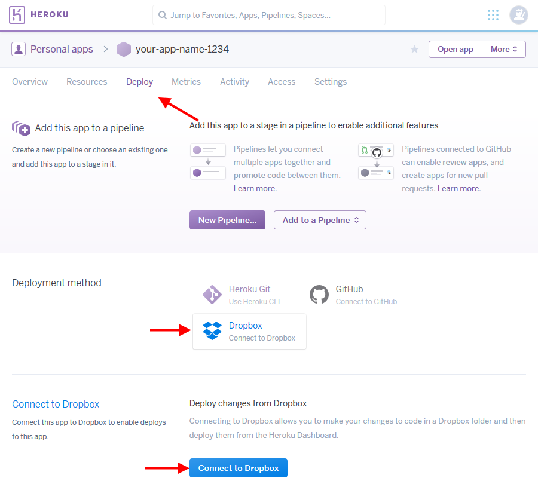
	- Select **Dropbox** tile in the **Deployment method** section
	- Click **Connect to Dropbox** button in the **Connect to Dropbox** section
		- In the popup window click **Allow** button to give Heroku access to your **Dropbox**
		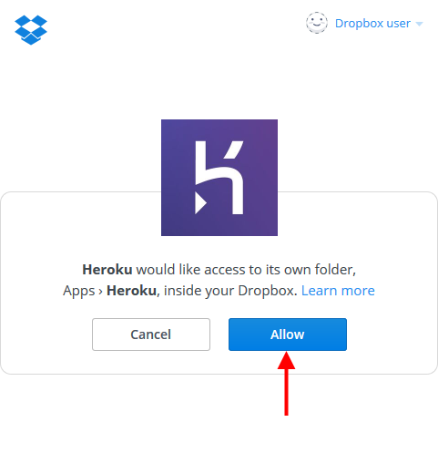
	- Upload [Heroku application](./HerokuApp) files (index.js, package.json and Procfile) to your Dropbox account (Dropbox/Apps/Heroku/\<your-app-name\>)
	- Enter commit message and click **Deploy** button in the **Deploy changes** section
	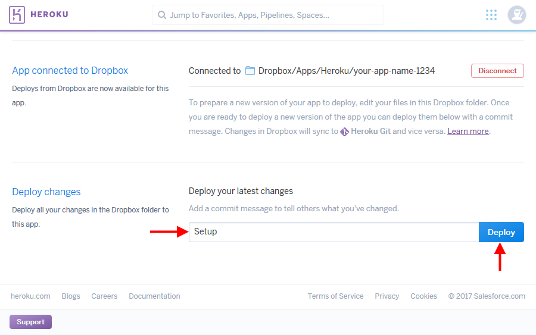

### Step 6: Build and Run the Electric Imp Application

Go to the Electric Imp IDE and select your device from the sidebar for the final setup steps.

- Open the Electric Imp IDE & select your device. Find the *HEROKU APP URL* section at the bottom of the Agent code and enter **URL of the Heroku application**.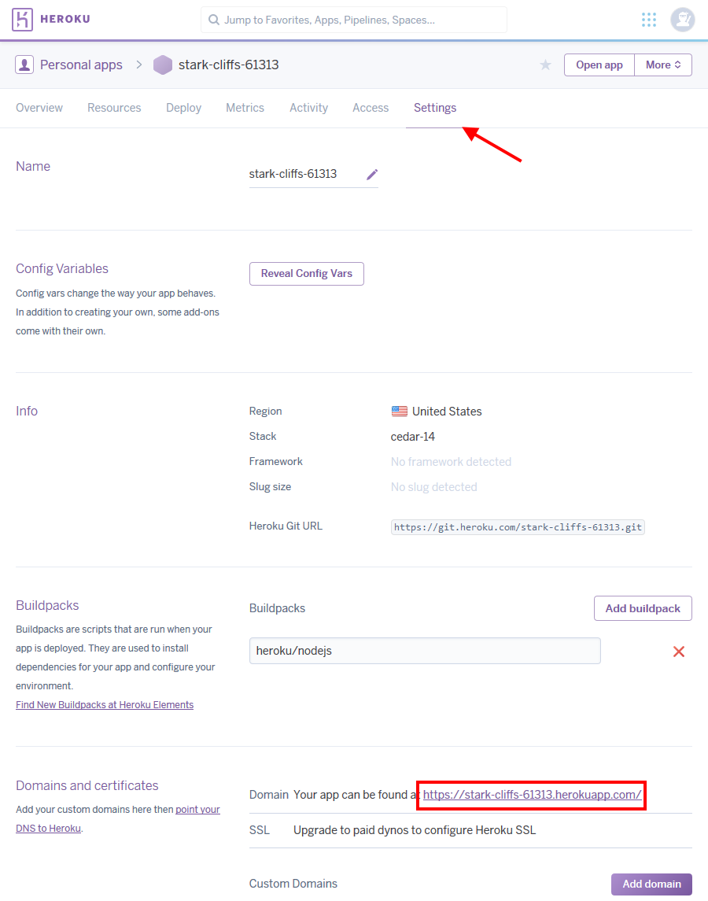
- Hit **Build and Run** to save and launch the code 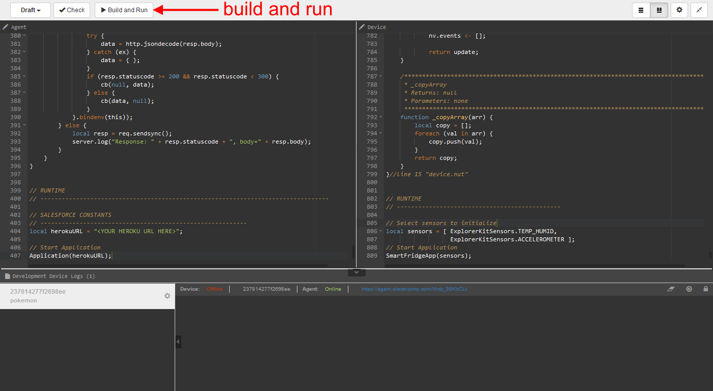
- Click on the agent url to launch the log in page
- Log into salesforce

Your App should now be up and running.  You can monitor the device logs in the IDE, or log into Salesforce web portal to see updates there.

### Step 7: Install Device in Refrigerator

Open your refrigerator and place the Explorer Kit on a shelf in your refrigerator door.


If you don't have a fridge handy for this scenario, you can test the door being open by moving or tapping the kit, and keeping the Imp in a lit room.  A door open for thirty seconds should register a case.

### Step 8: Monitor the data in Salesforce1

Now that you have connected your Imp to Salesforce, it might be handy to see that data on a mobile device.  Using Salesforce1, it is easy to keep track of your Smart Fridge on the go.

#### Create a Custom Object Tab

First, let's give the custom object a tab so that Salesforce1 can add it to the left navigation.

1. Log in to your Developer Edition.
2. In the top nav, click Setup.
3. In Setup, enter Tab into the Quick Find box and select *Build* | *Create* | *Tabs*.
4. Under Custom Object Tabs, click *New*
5. Choose *SmartFridge* from the Object dropdown
6. Choose Thermometer as the Tab Style

7. Click *Next*, *Next*, and then *Save*

#### Open Salesforce1 in Chrome

You can access the Salesforce1 mobile app in three ways:

* As a downloadable mobile app (Salesforce1) that you install on your phone from the Apple AppStore or Google Play
* By navigating to `login.salesforce.com` using a mobile browser
* By using the Chrome Developer Tools

For this step, we'll use the last option. First ensure that Salesforce1 is available through a desktop browser and is enabled for your user:

1. Log in to your Developer Edition.
2. In the top nav, click *Setup*.
3. In Setup, enter Salesforce1 into the Quick Find box and select *Mobile Administration* | *Salesforce1* | *Salesforce1 Settings*.
4. Ensure the Enable the Salesforce1 mobile browser app is checked.

5. In Setup, enter Users into the Quick Find box and select *Administer* | *Manage Users* | *Users*.
6. Click *Edit* next to the name you used to create your developer edition.
7. Ensure that Salesforce1 User is checked. (Update and save as needed.)


Next we'll emulate the Salesforce1 Mobile App in the Chrome web browser:

1. Open a new tab in your Chrome browser and open the Developer Tools by clicking *View* | *Developer* | *Developer Tools*
2. Click the Toggle Device Mode button to simulate your browser as a mobile device.

3. To simulate the Salesforce1 app in your browser, copy and paste in the URL from the previous tab. Remove the part of the URL immediately after salesforce.com/. For example:


4. Append `/one/one.app` to the end of the URL after salesforce.com to start the Salesforce1 Application simulator. For example:

5. If the display is too small, change the size to 100%.

6. Click the three white bars in the upper left to open the left navigation
7. Under the "Recent" section, scroll down and click *More*

8. You will see "SmartFridges" somewhere on the list. Click *SmartFridges*

9. Select a record to view the details of the reading.


### Step 9: Use Process Builder to Chatter Fridge data

Finally, let's add some finesse to our application by using Process Builder to drive a Chatter conversation based on the incoming readings, which create the case.


#### Create a new Process Builder
1. Log in to your Developer Edition.
2. In the top nav, click *Setup*.
3. In Setup, enter Process Builder into the Quick Find box and select *Create* | *Workflow & Approvals* | *Process Builder*.
4. Click *New*.
5. Name the new process *Post SmartFridge Case to Chatter*.
6. Click *Save*.
7. Click *Add Object*.
8. In the Find an Object dropdown, select *Case*.
9. Click *Save*.


#### Setup the Process Criteria

Next we'll set up the criteria that will fire the process:

1. Click *Add Criteria*.
2. For Criteria Name, enter *Related to SmartFridge*.
3. In set conditions, click *Find a Field*.
4. Use field selector to find *Related_Fridge__c*.
5. For Operator, select *Is null*.
6. Keep the values of *Boolean* and *False*.
7. Click *Save*.


#### Add an Action

In the Immediate Actions box next to your new criteria, click *Add Action* and configure as follows:

1. Action Type: *Post to Chatter*
2. Action name: *Post SmartFridge Case Data*
3. Post to: *User*
4. User: *Select a user from a record*
5. Click in the Find a user... box, select *Owner ID (User)*, select *User ID*, and then click *Choose*.
6. Copy and paste the following text into the Add a message, mention a user or group... text box:

```The case ({![Case].Id}) was opened regarding the Smart Fridge {![Case].Related_Fridge__r.DeviceId__c}. This fridge was recorded at a temperature of {![Case].Related_Fridge__r.Temperature__c}, humidity of {![Case].Related_Fridge__r.Humidity__c}, and a door status of {![Case].Related_Fridge__r.Door__c}.```


1. Click Save. Your process should now look like this:


2. Click Activate.

Now whenever a case is created that has a related Smart Fridge, the important data about that fridge will be accessible right from the case owners's chatter feed.

#### Test Your Process

Let's try out the process by keeping the fridge door open for over 30 seconds. This should trigger Salesforce to create a case. Because the case is related to a fridge, the case will be posted to your Chatter feed.


## License

The Salesforce library is licensed under the [MIT License](./LICENSE).
